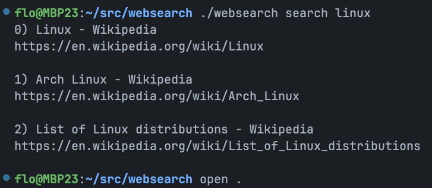
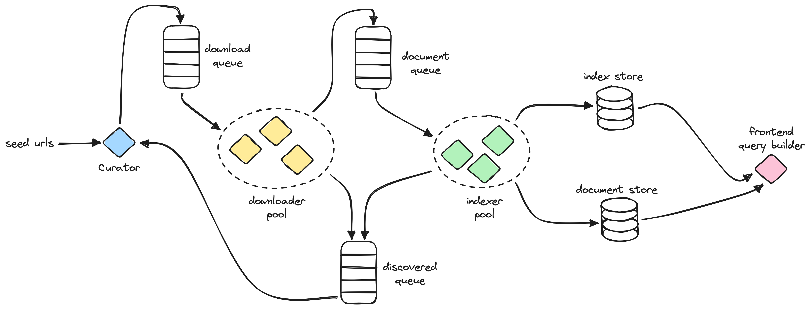

# websearch



Let's build a search engine for the web, just for fun. 🥳

## Features

- Crawling, searching and a web server
- Single sqlite file to store the index
- Result ranking (just query to docuemnt match)
- Possible to index 1k pages in 10sec.

And many more are planned ^^

## Build it yourself

You need [golang](https://go.dev/) and [node](https://nodejs.org/en) to build 
this project.

```bash
npm install
npx tailwindcss -i ./web/style.css -o ./web/static/style.css

go build
./websearch index
./websearch search "Linux"
./websearch server
```

Note: During development it is handy to let the tailwind command run with the
`--watch` flag in a separate terminal.

## Build with docker

```bash
# Build the image
docker build -t "websearch" .

# Build the index
docker volume create websearch_index
docker run \
    --rm \
    --mount source=websearch_index,target=/app/data \
    websearch index --sqlite data/index.db

# Serve the index 
docker run \
    --rm \
    -p 8080:8080 \
    --mount source=websearch_index,target=/app/data \
    websearch server --sqlite data/index.db
```

## Profiling

To improve performance it is necessary to know where the bottle-necks are and 
if the optimization really has the desired impact.

When working on the indexer you can create a profile with the `--profile` flag
and open it with `pprof` (the flamegraph is quite helpful).

```bash
./websearch index -n 500 --profile
go tool pprof -http="localhost:7000" cpu.prof
```

## Architecture




## Contributing 

Almost all improvements are welcome, just try it out and pick a subject that 
looks interesting to you. 😉

However, if you don't know where to start you can start with a random `FIXME`
and make some progress `git grep "fixme" | shuf -n 1`.

You can also open the `index.db` database (for example with 
[DB Browser for SQLite](https://sqlitebrowser.org/)) and find anomalies there 
and try to improve them.

In any case, just have fun 🥳